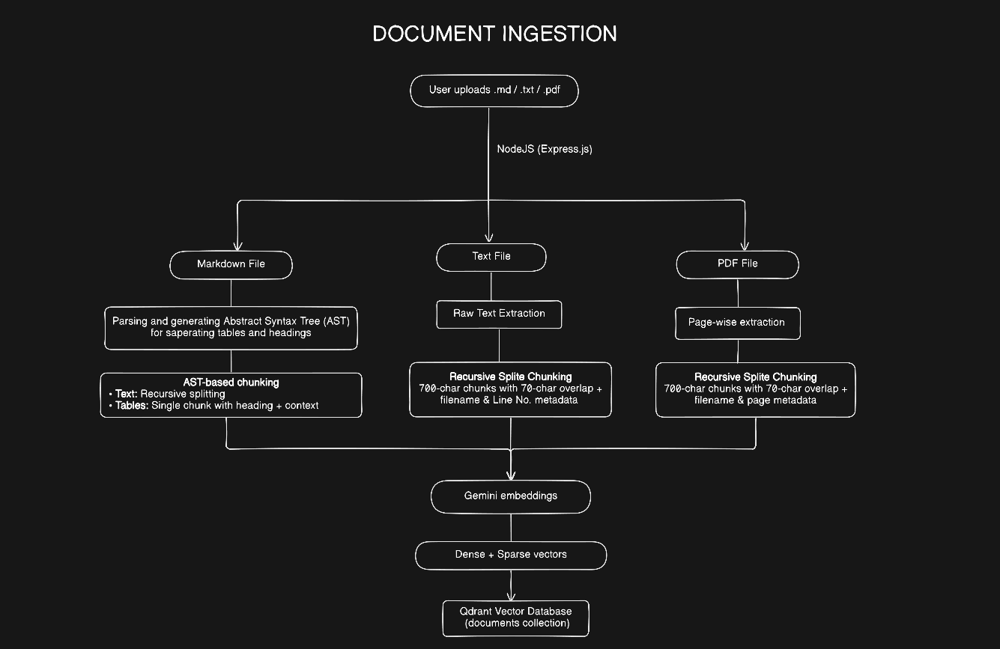
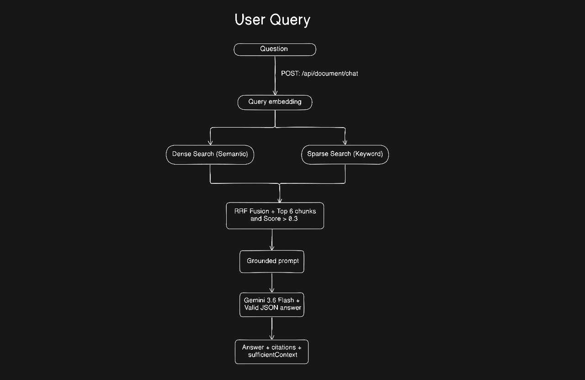

# DESIGN.md — HR Policy RAG Assistant Architecture & Design

## 1. Architecture

The system is a **retrieval-augmented generation (RAG) HR policy assistant**. Its core design goal is simple: **answers must come from indexed company documents, with explicit source citations, and weak retrieval must fail safely instead of encouraging the model to guess.**

### High-level flow




### Components

| Component | Responsibility |
|---|---|
| `server.js` | Loads environment configuration, initializes Qdrant, starts the HTTP server. |
| `app.js` / routes | Express setup, CORS/JSON middleware, health endpoint, upload and chat routes. |
| `document.controller.js` | Validates requests and coordinates ingestion/search/generation. |
| `document.service.js` | Selects the parser and chunking strategy by file type. |
| `parsers/*` | Converts Markdown/PDF/source files into structured text blocks or pages. |
| `chunkers/*` | Creates retrieval-sized chunks while preserving useful document context. |
| `embedding.service.js` | Generates dense embeddings using `gemini-embedding-2`. |
| `sparse.service.js` | Produces hashed-token sparse vectors using term frequency. |
| `qdrant.service.js` | Stores vectors/payloads and performs hybrid retrieval with RRF. |
| `prompt.builder.js` | Builds a strict, source-aware prompt that constrains the LLM to retrieved context. |
| `generation.service.js` | Generates and parses the final JSON response using `gemini-3.6-flash`. |

---

## 2. Chunking & Retrieval

### File-aware parsing and chunking
Different file types have different structures, so the pipeline uses file-aware parsing and chunking instead of one generic splitter. Each format is handled separately to preserve structure and improve retrieval.

#### Markdown Chunking
The goal is to **keep tables as complete chunks** while splitting normal text independently. This ensures table-based questions can retrieve the full table instead of isolated rows.

The Markdown pipeline follows three steps:

1. **Parse:** Convert Markdown into an Abstract Syntax Tree (AST) using `remark-parse` and `remark-gfm`.

```json
{
    "type": "root",
    "children": [
        {
            "type": "heading",
            "depth": 1,
            "children": [
                {
                    "type": "text",
                    "value": "Benefits Policy",
                    "position": {.....}
                }    
            ],
            "position": {....}
        },
        {
            "type": "table",
            "align": [.... ],
            "children": [.....],
            "position": {....}
        }
    ]
}
```
2. **Normalize:** Extract headings, paragraphs, and tables into a simplified structure.
```json
[
    {
        "type": "heading",
        "depth": 2,
        "text": "2. Health coverage tiers",
        "position": {.....}
    },
    {
        "type": "paragraph",
        "text": "Employees are enrolled in one h...",
        "position": {....}
    },
    {
        "type": "table",
        "headers": [....],
        "rows": [[....]],
        "position": { ....}
    },
    {
        "type": "paragraph",
        "text": "Network hospital cashless access...",
        "position": {.....}
    }
]


````
3. **Chunk:**
   - **Tables:** Kept as a single chunk with heading and surrounding context.
   - **Text:** Split using `RecursiveCharacterTextSplitter` with **700-character chunks and 70-character overlap**.
   - **Metadata:** Store section and filename with each chunk.
```json
[
    {
        "type": "text",
        "text": "....",
        "metadata": {
            "section": "Benefits Policy",
            "fileName": "benefits-policy.md"
        }
    },
    {
        "type": "table",
        "text": "....",
        "metadata": {
            "section": "Benefits Policy > 2. Health coverage tiers",
            "fileName": "benefits-policy.md"
        }
    }
]

```
#### Text File Chunking

After extracting the text, we incrementally split it into **700-character** chunks with a **70-character** overlap, while recording the corresponding line ranges, such as `Lines 40–65`.

Text File Chunks:
```json
[
  {
      "type": "text",
      "text": "....",
      "metadata": {
          "section": "Lines 40 - 65",
          "fileName": "benefits-policy.txt"
      }
  }
]
```
#### PDF File Chunking

Extracted page-by-page, then split with the same **700/70** text with the help of `RecursiveCharacterTextSplitter`. Each chunk retains its source filename and page-based section label.

PDF File Chunks:
```json
[
  {
      "type": "text",
      "text": "....",
      "metadata": {
          "section": "Page Number 1",
          "fileName": "leave-policy.pdf"
      }
  }
]
```
### Chunk Embedding and Storage

Before storing the chunks into database, system creates two vector, 
1. A **dense embedding** using `gemini-embedding-2`, capturing semantic similarity.
2. A **sparse vector** built from normalized, hashed tokens and term frequency, preserving lexical matches for exact policy language and terms.

The chunks and their vectors are then stored in **Qdrant** for retrieval.

### Hybrid retrieval

For a user query, the system creates both:

1. **dense embedding**.
2. **sparse vector**.

Qdrant retrieves up to **20 candidates from each signal**, then combines the rankings using **Reciprocal Rank Fusion (RRF)**. The final result set is limited to **6 chunks**, and results below a **0.3 fused score threshold** are removed.

This hybrid approach is deliberate: semantic retrieval helps with paraphrased questions, while sparse retrieval helps when exact words, policy terms, limits, or category names matter.

---

## 3. Grounding & Safe Failure

Grounding is enforced at multiple layers rather than relying on the model to “behave.”

### Prompt-level constraints

The RAG prompt explicitly instructs the model to:

- use **only the retrieved context**;
- never guess or introduce outside knowledge;
- read tables precisely when the question targets structured policy data;
- refuse when the evidence is insufficient;
- attach a citation to every factual claim;
- reproduce the exact `fileName` and `section` supplied by retrieval.

The model must return a fixed JSON contract with:

```text
answer
sufficientContext
citations[] = { fileName, section, quote }
```

### Retrieval-level safety

A query first passes through hybrid retrieval and a score filter. When no usable chunks remain, the controller returns:

```text
I don't have enough information to answer this; please contact HR.
```

with `sufficientContext: false` and an empty citation list.

### Generation-level safety

`generation.service.js` requests JSON output explicitly. If the model response cannot be parsed as JSON, the service returns a safe failure response instead of trusting malformed output.

Together, these controls create a **fail-closed policy assistant**: lack of evidence becomes a refusal, not an invented answer.

---

## 4. Schema & APIs

### `POST /api/document/upload`

Multipart form upload with field:

```text
file: <.md | .txt | .pdf>
```

Successful response:

```json
{
  "message": "Document stored successfully"
}
```

Why this schema: upload requests only need the source document; parsing, chunking, embedding, and indexing remain internal implementation details.

### `POST /api/document/chat`

Request:

```json
{
  "query": "What is the casual leave carry-forward limit?"
}
```

Successful response follows the model-validated contract:

```json
{
  "answer": "...",
  "sufficientContext": true,
  "citations": [
    {
      "fileName": "leave-policy.md",
      "section": "Leave Policy > Casual Leave",
      "quote": "..."
    }
  ]
}
```

Weak/insufficient context:

```json
{
  "answer": "I don't have enough information to answer this; please contact HR.",
  "sufficientContext": false,
  "citations": []
}
```

The schema keeps **answer quality, confidence state, and provenance separate**, which makes the API straightforward for a UI to render and for downstream systems to audit.

### `GET /api/health`

Returns a simple JSON health message for basic service monitoring.

---

## 5. Key Trade-offs
### Structure-aware chunking vs. one generic splitter
**Rejected:** applying one text splitter uniformly to every file type.

Markdown contains headings and tables that carry meaning beyond raw text. Treating a policy table like ordinary prose can weaken retrieval and citation quality. The implementation therefore preserves Markdown structure and treats tables as first-class chunks, while TXT and PDF use format-appropriate strategies.

### Complete table context vs. smaller chunks

**Chosen:** preserve complete Markdown tables with surrounding context.

Although large tables create bigger chunks, keeping the full table with nearby paragraph context improves accuracy for aggregation and row-dependent questions where the complete table is required.

**Why nearby paragraph is required?**

Let's consider the below table

| Leave Type | Eligibility | Annual Limit | Carry Forward |
| --- | --- | ---: | ---: |
| Casual Leave | All employees | 12 days | 3 days* |
| Sick Leave | All employees | 10 days | 5 days |
| Earned Leave | Employees after probation | 18 days | 10 days* |

\* Carry-forward limits apply after **6 months of continuous service**.

Now, to answer a Casual Leave-related question, we require the table and its **nearby context as well**.

### Hybrid retrieval vs. dense-only retrieval
**Rejected:** dense-only search.

Dense retrieval is excellent for semantic similarity, but HR policies often contain exact terms, tier names, limits, exclusions, and short phrases where lexical matching matters. The current design therefore combines dense and sparse retrieval and fuses rankings with RRF.


---

## 6. Future Improvements & Hardening
### 1. Better PDF and table handling
Harden extraction for complex PDF layouts, especially multi-column text and tables. Preserve page/row context more precisely so structured policy questions remain trustworthy across real-world HR documents.

### 2. Access control and feedback
Add authentication/authorization so users can retrieve only documents they are allowed to see, then collect feedback on answers and refusals to continuously improve retrieval thresholds, chunking, and prompts.

### 3. Scalable Document Processing
Move document processing and vector indexing to a background worker using a queue such as BullMQ. Since parsing, chunking, embedding, and storing documents in the vector database can be time-consuming, asynchronous processing would keep the API responsive and allow the system to scale with larger document volumes.

---

## Engineering Summary

This design favors a practical production path: **format-aware ingestion → hybrid vector retrieval → strict grounding → cited JSON responses → safe refusal**. The result is not simply a chatbot over documents; it is a policy-focused retrieval system designed around **traceability, deterministic response contracts, and conservative failure behavior**.
